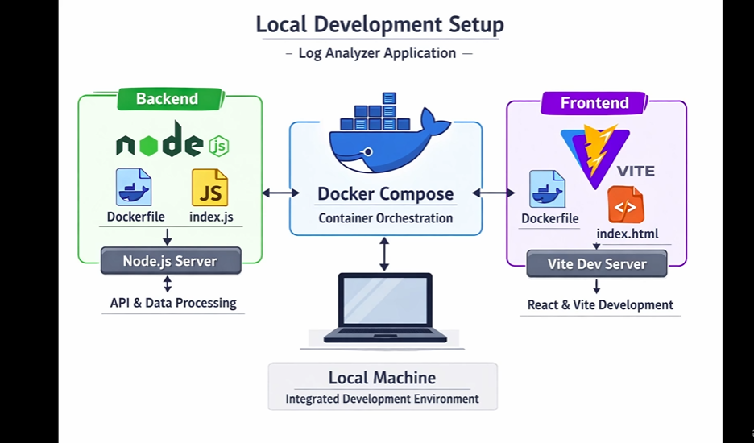
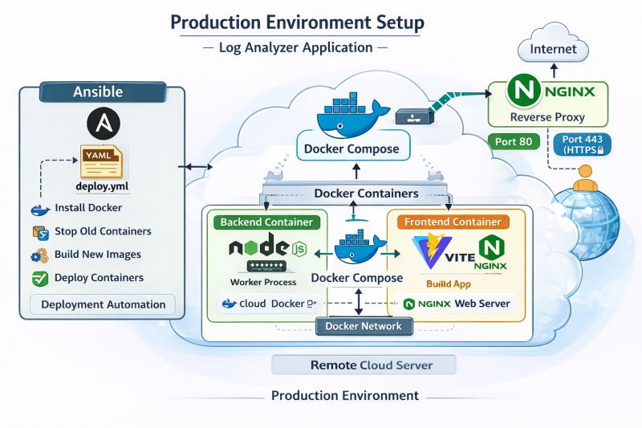
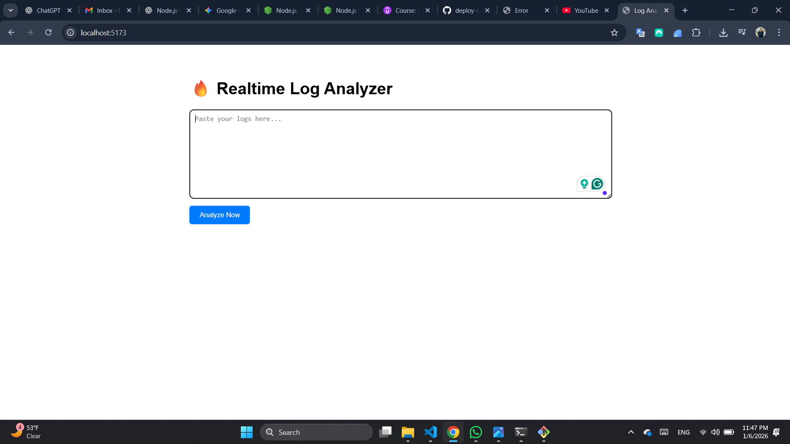
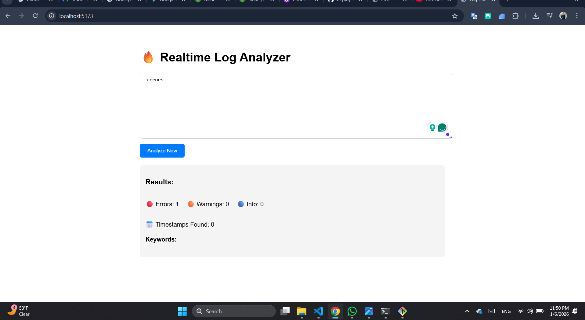
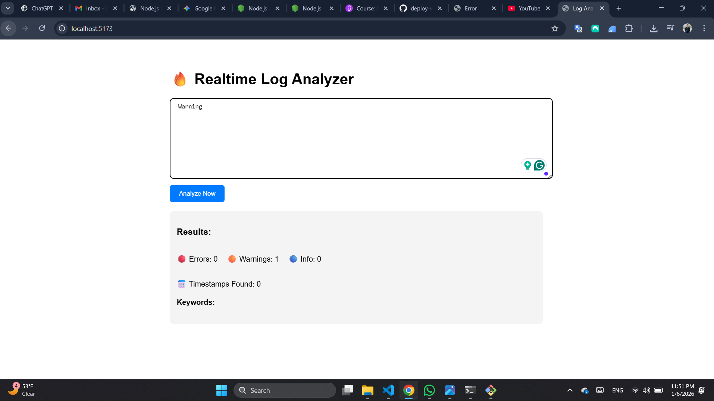

# Log Analyzer – Full-Stack Log Insights Platform 🚀

A **production-ready full-stack log analysis application** that helps developers and DevOps teams quickly understand what’s happening inside their systems by summarizing **Errors, Warnings, and Info logs** in seconds.

Built with **Node.js**, **React**, **Docker**, and **Ansible**, and designed for **real-world deployment**.

---

## 🔍 Why This Project?

Modern systems generate massive amounts of logs.
Manually scanning them is **time-consuming, error-prone, and inefficient**.

**Log Analyzer** solves this by:

* Automatically analyzing raw log files
* Highlighting critical severity levels
* Providing instant insights instead of raw noise

This project focuses on **clarity, speed, and deployability**, not just code.

---

## ⚠️ Known Deployment Consideration

> When running locally inside Docker, containers communicate using **service names** (e.g., `backend:5000`).
> But browsers outside Docker **cannot resolve container names**.

**Solution:**

* Use the **host/server IP** in the frontend environment variable (`VITE_API_URL`) to ensure the frontend can reach the backend from any browser in your network.
* Example `.env`:

```env
VITE_API_URL=http://192.168.1.5:5000
```

* This ensures the app works **anywhere**, whether at home, in the office, or on cloud servers.

---

## ✨ Features

* 📊 Count **ERROR / WARN / INFO** log entries
* 🕒 Detect timestamps in logs
* 🔎 Identify common infrastructure keywords (network, auth, database, etc.)
* ⚡ Fast API response (stateless backend)
* 🌐 Modern UI with React + Vite
* 🐳 Fully containerized with Docker
* 🔁 Easy local orchestration using Docker Compose
* 🚀 Cloud-ready deployment (Render + Netlify)

---

## 🧱 Architecture Overview

```text
Frontend (React + Vite) ──▶ Backend (Node.js / Express)
        │                          │
        │                          ▼
     Netlify                  Log Analysis Engine
                                   │
                              Docker Container
```

* **Frontend**: Static SPA deployed on Netlify
* **Backend**: REST API deployed on Render
* **Local Dev**: Docker + Docker Compose
* **Automation**: Ansible (infrastructure & provisioning)

---

## 🛠 Tech Stack

### Frontend

* React
* Vite
* JavaScript
* Netlify (deployment)

### Backend

* Node.js
* Express
* CORS & dotenv
* REST API

### DevOps & Infrastructure

* Docker
* Docker Compose
* Ansible
* Render (backend hosting)

---

## 🔄 Application Workflow

1. User pastes or uploads raw log data
2. Frontend sends logs to backend API
3. Backend analyzes:

   * Severity levels
   * Keywords
   * Timestamps
4. Results are returned as structured JSON
5. Frontend displays insights clearly

---

## 📁 Project Structure

```text
log-analyzer/
├── backend/
│   ├── Dockerfile
│   ├── index.js
│   ├── package.json
│
├── frontend/
│   ├── Dockerfile
│   ├── index.html
│   ├── src/
│
├── ansible/
│   ├── inventory/
│   └── playbooks/
│
├── docker-compose/
│   └── docker-compose.yml
│
└── README.md
```

---

## 🐳 Docker & Docker Compose (Local Development)

### Run full stack locally

```bash
cd docker-compose
docker compose up --build
```

### Services

* Frontend: [http://localhost:5173](http://localhost:5173)
* Backend: [http://localhost:5000](http://localhost:5000)

> ⚠️ **Important:** In browsers, the frontend must use the **server IP** to reach the backend (`VITE_API_URL=http://<server-ip>:5000`).
> Containers talk via service names (`backend`) **inside Docker**, but this does not work from host/browser.

---

## ☁️ Cloud Deployment Strategy

### Backend – Render

* Deployed as a **Docker Web Service**
* Uses `process.env.PORT`
* Health check endpoint: `/health`

### Frontend – Netlify

* Static build using Vite
* API URL injected via environment variable

```env
VITE_API_URL=https://<render-backend-url>
```

This separation mirrors **real production environments** used by modern teams.

---

## 🔐 Security & Stability Considerations

* Stateless backend (safe for scaling)
* Graceful shutdown handling (`SIGTERM`)
* CORS configurable via environment variables
* No hardcoded ports or URLs

---

## 📈 Business Value

* Reduce debugging time
* Improve incident response
* Help teams focus on **actionable insights**
* Suitable for DevOps, SRE, and backend teams

This project demonstrates **engineering maturity**, not just feature implementation.

---

## 🔮 Future Improvements

* Real-time log streaming
* Slack / Email alerts
* Log severity visualization dashboards
* Authentication & role-based access
* Persistent storage & history tracking

---

## 📸 Screenshots & Visuals

### Architecture Diagrams

#### Local Development Architecture


#### Production Web App Architecture


### Application in Action

#### Running Application - Screenshot 1


#### Running Application - Screenshot 2


#### Running Application - Screenshot 3


---

```http
GET /health
```

Returns:

```
OK
```

---

## 👤 Author

**Belal Mahmoud**
DevOps Engineer

* GitHub: https://github.com/Belal2015
* LinkedIn: https://www.linkedin.com/in/belal-mahmoud-devops/
* Email: belalmahmoud8183@gmail.com

---

## 📜 License

MIT License – free to use, modify, and distribute.